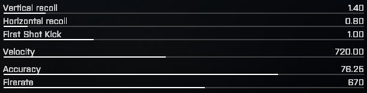

# Helious
Complete-_ish_ BattleBit recoil compensation


Uses the same concepts for hardware mouse injection as [Cezium](https://github.com/StrateimTech/Cezium) <br>
_Has since improved exponentially as of 3/6/2024_

## Features
- Supports **all** types of weapon configurations along with scopes
- Undetectable by EAC (Rust + BattleBit + Apex no ban +3 years)

## Cons
- Doesn't support horizontal recoil compensation. (Impossible)
- Doesn't support burst & single fire modes

## Input Tutorial
> Inputs, (Vertical, Initial, Rpm, Magazine Size, Fov) <br>
> Optional, (Smoothness, Scope (2x, 4x), Global Overflow, Local Overflow) <br>

### Required Inputs<br>
Stock AK74 for example<br>
``1.40, 1.0, 670, 30, 110``
* 1.40 = Vertical Recoil
* 1.0 = First Shot Kick
* 670 = Firerate
* 30 = Magazine capacity
* 110 = FOV <br>

Most of these can be found on the bottom right when choosing/modifying a weapon.


### Optional Inputs<br>
``1.40, 1.0, 670, 30, 110, 8, 2x, true, true``
* 8 = Smoothing (Divides the calculated recoil 8 times over a period smoothing it visually) (Use **0** if you want to leave it at default) (default: 0)
* 2x = Scope zoom (1.4x, 3.0x) (default: 1.0x)
* true = Attempts to compensate for loss in accuracy after each bullet. (default: true)
* true = ^, instead locally compensates for accuracy loss during smoothing process. (default: true)

## Gun setup tips
For the most accurate recoil compensation you'll want a weapon setup with the least horizontal recoil even if vertical recoil is high. (e.g. using "B C M- Gun Fighter" grip as it provides the most horizontal recoil reduction atm)

### Requirements
- RPi 4b or newer (Must have USB OTG)
- .NET 8 installed on local machine (**NOT on the RPI**), this is for compiling the binary.

## Installation
_**Read the requirements first!**_ <br>
Follow HID-API Gadget guide for first time [installation](https://github.com/StrateimTech/hid-api-rs?tab=readme-ov-file#first-installation). To verify if everything is setup correctly, ``ls`` into ``/dev/`` and see if ``hidg0`` and ``hidg1`` are present.
```
git clone https://github.com/StrateimTech/Helious
cd ./Helious
dotnet publish -c Release -o publish -r linux-arm
```
Transfer all files within the build directory to the RPi via your choice of method.
Don't forget to chmod :)
```
chmod +x ./Helious
sudo ./Helious
```
Requires elevated permission to access ``/dev/`` directory